# 51小车设计报告

## 目录

- [第一章 题目及要求..............................................](#题目及要求)
  - [1.1 智能公交设计..............................................](#智能公交设计)
  - [1.2 多功能循迹机器人设计......................................](#多功能循迹机器人设计)
- [第二章 总体方案设计...........................................](#总体方案设计)
- [第三章 硬件设计..................................................](#硬件设计)
  - [3.1 原理图......................................................](#原理图)
  - [3.2 编码器功能恢复..............................................](#编码器功能恢复)
  - [3.3 L298N电机驱动模块..........................................](#L298N电机驱动模块)
  - [3.4 DY-SV17F语音模块...........................................](#DY-SV17F语音模块)
- [第四章 软件设计..................................................](#软件设计)
  - [4.1 主体框架和分工.............................................](#主体框架和分工)
  - [4.2 51单片机的存储............................................](#51单片机的存储)
  - [4.3 定时器0模块................................................](#定时器0模块)
  - [4.4 定时器1模块................................................](#定时器1模块)
    - [4.4.1 黑色引导线位置检测........................................](#黑色引导线位置检测)
    - [4.4.2 任务状态切换..............................................](#任务状态切换)
    - [4.4.3 转换编码器数值为速度........................................](#转换编码器数值为速度)
    - [4.4.4电机与舵机控制............................................](#电机与舵机控制)
  - [4.5 外部中断模块................................................](#外部中断模块)
  - [4.6 主循环模块..................................................](#主循环模块)
  - [4.7 RC522模块...................................................](#RC522模块)
    - [4.7.1 原理简介..................................................](#原理简介)
    - [4.7.2 M1卡存储结构..............................................](#M1卡存储结构)
    - [4.7.3 工作流程..................................................](#工作流程)
    - [4.7.4 SPI通信...................................................](#SPI通信)
  - [4.8 智能公交设计的实现............................................](#智能公交设计的实现)
  - [4.9 多功能循迹机器人的实现........................................](#多功能循迹机器人的实现)
- [第五章 总结........................................................](#总结)
- [附录..............................................................](#附录)
  - [实物图..........................................................](#实物图)
  - [定时器0初始化代码................................................](#定时器0初始化代码)
  - [定时器1初始化代码................................................](#定时器1初始化代码)
  - [角度环PID计算代码................................................](#角度环PID计算代码)
  - [速度环PID计算代码................................................](#速度环PID计算代码)
  - [软件SPI写入RC522模块........................................](#软件SPI写入RC522模块)
  - [软件SPI读取RC522模块........................................](#软件SPI读取RC522模块)

## 题目及要求

### 智能公交设计
描述:设计并实现一辆智能公交小车，该小车具有路径识别和站点识别的功能。路径识别可通过检测黑色引导线实现，站点识别可通过读写卡模块对M1卡的读取实现。

具体要求:

- 1.具有路径识别功能(循迹);
- 2.具有站点识别功能(至少能够识别3个不同站点);
- 3.识别到不同站点时，应给出不同的声光提示(建议购置语音模块，进行实时站点播报);
- 4.使用89C52单片机作为系统主控;
- 5.提交包含硬件电路图及工程文件等资料，以及实验报告(包括关键代码注释，主要硬件连接关系等);

### 多功能循迹机器人设计

具体要求:

- 1.使用四轮车模套件组装轮式机器人，机器人运行的跑道由水平跑道部分和具有一定坡度的跑道部分构成;
- 2.所设计的机器人可沿黑色引导线快速稳定的移动;
- 3.所设计的机器人具有一定的爬坡能力;
- 4.当机器人运行至跑道终点时，自动停车5秒钟，并且有明显的声光提示;
- 5.停车5秒后，机器人自主启动并返回起点;
- 6.使用89C52单片机作为系统主控，使用四轮舵机车模(必要时可更换带编码器的电机);
- 7.要求读出编码器的数值，构成速度闭环，编写 PID 速度控制算法;
- 8.提交包含硬件电路图及工程文件等资料，以及实验报告(包括关键代码往释，主要硬件连接关系等);

## 总体方案设计

对两个题目的要求进行分析，可以发现两个题目的要求可以在同一个小车上实现，因此可以设计一个小车，硬件上具备两个题目的要求，软件上可以通过不同的模式来切换实现两个题目的要求。最终小车的总体方案如下

硬件：

- 1.使用STC89C52RC单片机作为系统主控，并使用12MHz的晶振;
- 2.使用四轮舵机车模套件为基础搭建小车;
- 3.使用两个四路红外传感器模块检测黑色引导线位置;
- 4.使用RC522模块读写M1卡;
- 5.使用语音模块和LED灯作为声光提示，语言模块同时可以进行实时站点播报;
- 6.使用L298N电机驱动模块驱动小车后轮电机;
- 7.使用MG996R舵机驱动前轮转向;

软件：

- 1.STC89C52RC单片机没有硬件SPI接口，所以使用软件模拟SPI接口来驱动RC522模块，通过读取M1卡的串号来识别不同站点，根据不同站点给出不同的声光提示;
- 2.编码器输出脉冲触发外部中断0和1，通过外部中断来读取编码器数值;
- 3.使用定时器0生成PWM波来提供舵机的控制信号和电机的速度控制信号;
- 4.在定时器1里实现黑色引导线位置检测、任务状态切换、读取编码器数值、PID速度控制算法、控制小车运行状态等功能;
- 5.在主循环里实现读取M1卡、语音播报、LED灯控制等功能;
- 6.检测出黑色引导线位置后，进行位置式PID运算再输出到小车舵机，以获得更好的循迹效果;
- 7.为了让小车能保持在预期速度运行，并且需要抑制积分分离现象，使用增量式PID算法来控制小车速度;

## 硬件设计

### 原理图

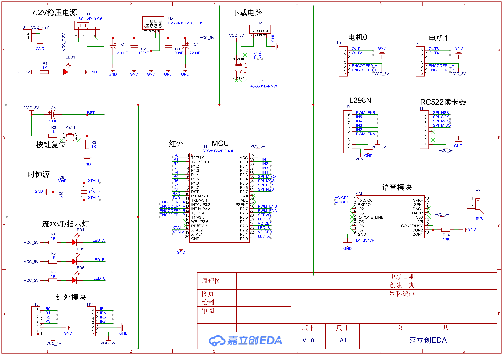

### 编码器功能恢复

电机上自带的编码器出厂只有一路脉冲信号输出，即黄色线A相，只能获取电机转速，不知道电机转动的方向。为了恢复编码器完整的功能，需要对编码器进行改造，恢复另一路脉冲信号输出。具体改造方法如下：

- 1.卸下电机，使用一字螺丝刀撬开电路板上方的磁环，撬开过程需要注意不要损坏电路板上的元件和磁环;

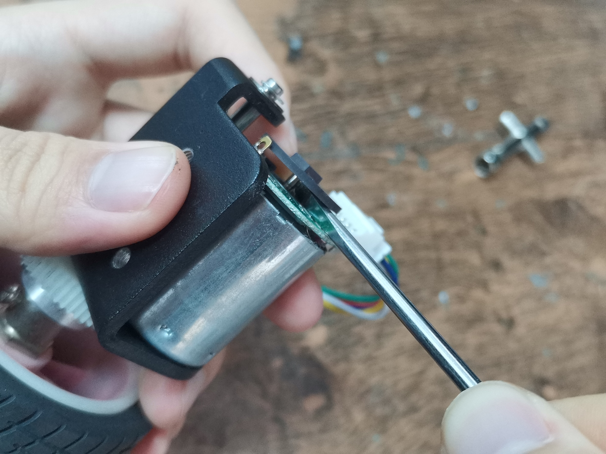

- 2.撬开后可以看到电路板上有两个SOT-23焊盘，分别标着IC1和IC2，其中IC1已经焊好了霍尔元件，IC2焊盘没有焊霍尔元件，需要在这个焊盘上焊上一个霍尔元件，恢复另一路脉冲信号输出;

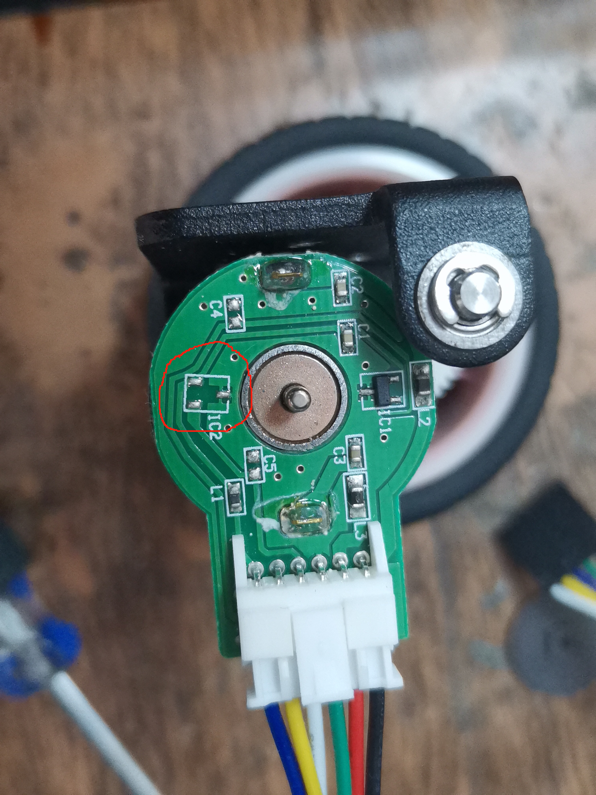

- 3.由于编码器的两路脉冲信号输出比较微弱，需要接上拉电阻使信号电平稳定，将两路脉冲信号(黄线和白线)串上1K欧姆的上拉电阻到编码器电源正极(蓝线)上;

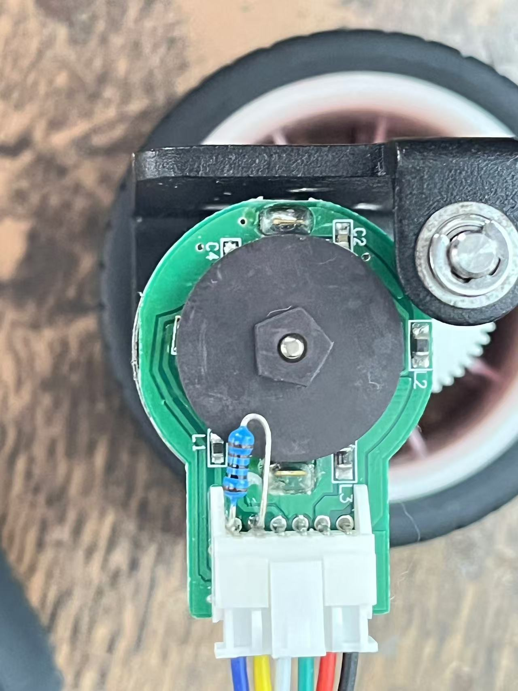

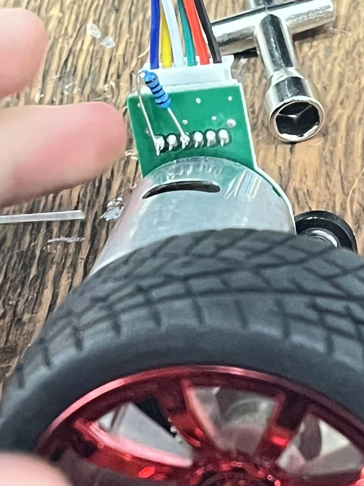

- 4.焊好霍尔元件和上拉电阻后，将磁环重新装回电路板上，然后将电机装回小车上;

编码器接线图:

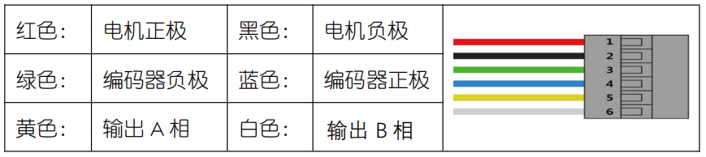

观察恢复前的波形图，可以看到只有一路脉冲信号输出，并且会不断减弱:

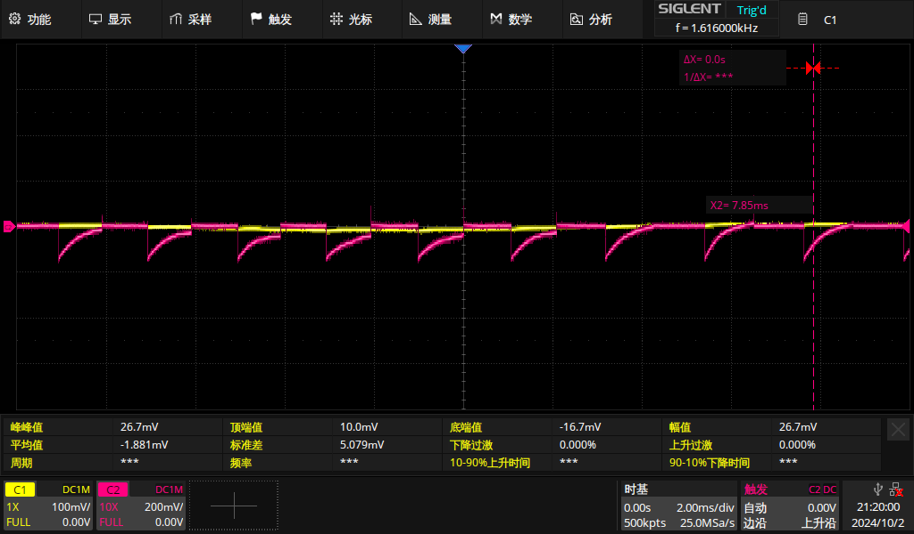

观察恢复后的波形图，可以看到两路脉冲信号输出，且信号电平稳定、健壮，可以分辨出正转和反转:

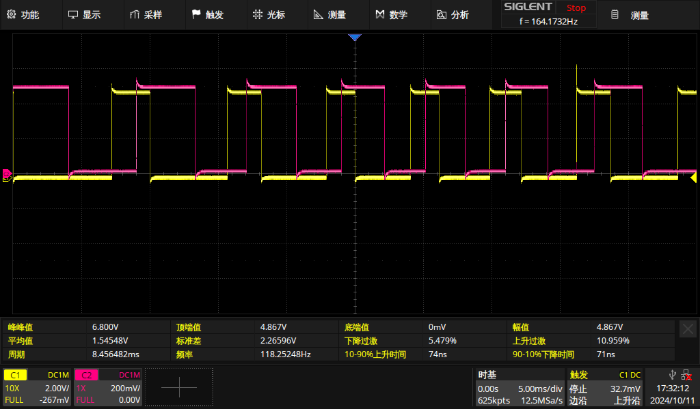

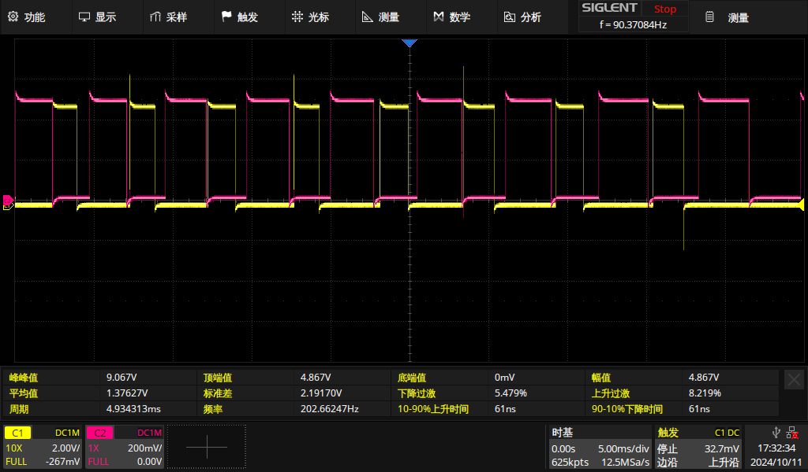

### L298N电机驱动模块

L298N电机驱动模块是一款双H桥直流电机驱动模块，可以驱动两个直流电机，最大电流为2A，最大电压为46V。L298N电机驱动模块的引脚功能和接线情况如下:

- 1.ENA: 电机A使能端，输入PWM对电机A进行调速;
- 2.IN1: 电机A输入端1，输入高低电平控制电机A正反转;
- 3.IN2: 电机A输入端2，输入高低电平控制电机A正反转;
- 4.IN3: 电机B输入端1，输入高低电平控制电机B正反转;
- 5.IN4: 电机B输入端2，输入高低电平控制电机B正反转;
- 6.ENB: 电机B使能端，输入PWM对电机B进行调速;
- 7.OUT1: 电机A输出端1，接电机A正极;
- 8.OUT2: 电机A输出端2，接电机A负极;
- 9.OUT3: 电机B输出端1，接电机B正极;
- 10.OUT4: 电机B输出端2，接电机B负极;
- 11.GND: 接地，与电池负极连接;
- 12.+12V: 电源正极，与电池正极连接;
- 13.+5V: 输出5V电压，给单片机及外设供电;

使用5V输出给单片机及周围器件供电，两对输出给电机供电，EN使能端输入PWM波来控制电机速度，IN输入端控制电机正反转。

### DY-SV17F语音模块

DY-SV17F语音模块集成IO分段触发，UART串口控制，ONE_line单总线串口控制，标准MP3等7种工作模式；板载 5W D类功放，可直接驱动 4Ω 3~5W 喇叭；支持 MP3、WAV解码格式，板载 32Mbit（4MB）flash存储，可通过USB数据线连接电脑更新音频文件。

DY-SV17F语音模块支持以下工作模式，通过检测CON0 CON1 CON2引脚电平来决定:

- 1.IO组合模式0:8个IO口组合控制255个音频文件播放，触发后播放一次音频，解除触发则等待播放结束后停止。
- 2.IO组合模式1:8个IO口组合控制255个音频文件播放，触发后一直循环播放音频，解除触发立即停止音频。
- 3.IO独立模式0:8个IO口独立控制8个音频文件播放，触发后播放一次音频，解除触发则等待播放结束后停止。
- 4.IO独立模式1:8个IO口独立控制8个音频文件播放，触发后一直循环播放音频，解除触发立即停止音频。
- 5.UART串口模式:根据相应的通信协议与模块通信，进行播放、暂停、停止、切换、调音量等操作。
- 6.单总线串口模式:根据相应的通信协议与模块通信，进行播放、暂停、停止、切换、调音量等操作。
- 7.标准MP3模式:通过5个IO口分别控制播放、暂停、均衡器、上一曲、下一曲等操作。

对题目要求进行分析，只需要在检测到站点时播放相应的音频文件即可，而且单片机的IO口资源比较紧张，因此使用IO组合模式0。

要让该模块工作在IO组合模式0，需要将CON1 CON2 CON3三个引脚下拉到地，然后在SPK+ SPK-两个引脚接入喇叭，通过IO0 IO1两个引脚输入控制信号，两个引脚可以控制三个音频文件的播放，如果需要播放更多音频文件，可以再接更多的IO引脚，或者使用UART串口通信方式。

该模块默认音量为20，最大31，可以通过串口进行音量调节，但是下次上电后音量会恢复到默认值，所以我选择使用ffmpeg增大音频文件的音量，同时添加参数缓解音频文件失真。

```shell
ffmpeg -i input.mp3 -ac 1 -filter:a "volume=50,alimiter=limit=0.99,compand=gain=-1" 00001.mp3
```

将提前录制好的站点播报音频经过处理后，命名为00001.mp3 00002.mp3 00003.mp3，通过数据线传入模块，通过控制IO0 IO1引脚的电平即可播放相应音频。

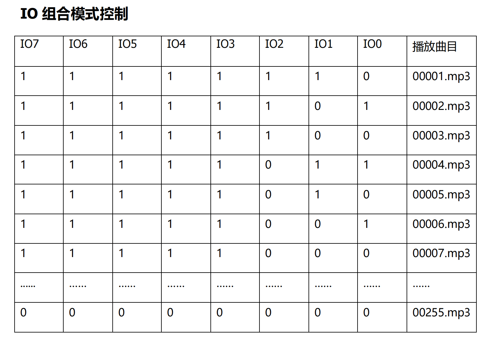

## 软件设计

### 主体框架和分工

根据题目的要求，可以根据任务的实时性和性能需求，将软件设计分为以下几个模块:

- 1.定时器0模块: 用于产生PWM波，控制舵机的转向角度和电机的速度;
- 2.定时器1模块: 用于产生定时中断，实现黑色引导线位置检测、任务状态切换、转换编码器数值为速度、PWM占空比设置、PID控制算法、控制小车运行状态等功能;
- 3.外部中断0模块: 用于读取左侧编码器数值;
- 4.外部中断1模块: 用于读取右侧编码器数值;
- 5.主循环模块: 用于读取M1卡、语音播报、LED灯控制等功能;

各部分流程图如下:

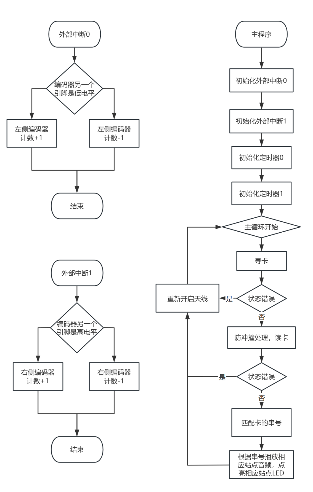

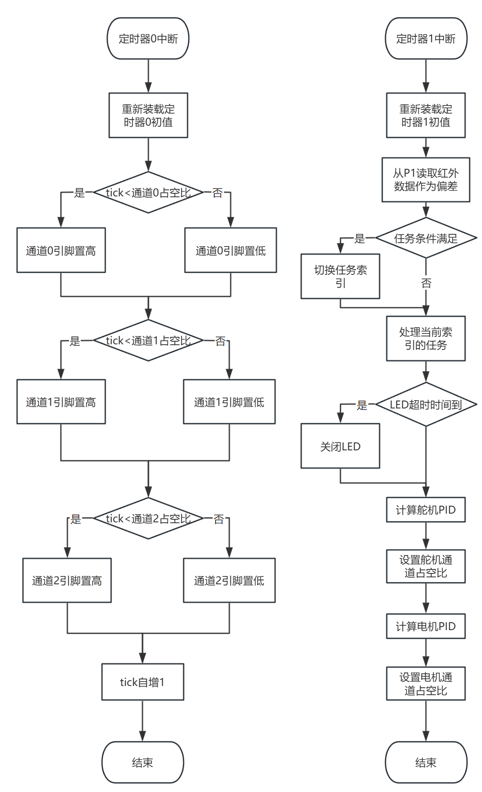

### 51单片机的存储

8051结构提供给用户3个不同的存储空间，程序存储器ROM，数据存储器RAM（内部RAM和外部RAM）。

code：访问程序存储器ROM，即常说的代码段，用来存放可执行代码，空间可达64K（0x0000~0xffff），该存储空间的代码段是只读的，在STC89C52RC单片机中，code区大小为8K（0x0000~0x1fff）。

data：访问可直接寻址的片内存储器，即内部RAM，即常说的DATA区，在整个RAM块中只占前128 字节（0x00~0x7f），因为它采用直接寻址方式，对变量访问得最快，通常把使用比较频繁的变量或局部变量存储在DATA段中。

bdata：可位寻址的片内存储器，即访问内部RAM，在其中从20H开始的16字节（0x20~0x2f）。

idata：使用间接寻址方式的内部RAM ，256个字节（0x00~0xff）。

xdata：使用间接寻址访问外部数据存储器，即外部RAM，大小64K（0x0000~0xffff），16位地址，称作外部数据区，简称XDATA区，访问XDATA须采用间接寻址+DPTR的方式，访问速度较慢。

pdata：访问当前页面内的外部RAM中的XDATA，每一页256字节，按页访问。PDATA段只有256个字节，而XDATA段可达65536个字节，对PDATA和XDATA的操作是相似的，但是对PDATA段寻址比对XDATA段寻址要快，因为对PDATA段寻址只需要装入8位地址，而对XDATA段寻址需装入16位地址，所以尽量把外部数据存储在PDATA段中。

例如，将一个变量var存储在不同区域让其自增1，对比其花费的指令周期

data区:

```assembly
INC     var   ;1个周期
```

idata区:

```assembly
MOV     R0,#LOW var
INC     @R0   ;2个周期
```

其中```#LOW var```是取var的低字节。

pdata区:

```assembly
MOV     R0,#LOW var
MOVX    A,@R0
INC     A
MOVX    @R0,A   ;6个周期
```

xdata区:

```assembly
MOV     DPTR,#var
MOVX    A,@DPTR
INC     A
MOVX    @DPTR,A   ;7个周期
```

从耗费的机器周期来看，data区访问速度最快，idata区次之，pdata区再次，xdata区最慢。

所以在程序设计中，应该尽量将读写频繁的变量存储在data区和idata区中，如PWM占空比、编码器数值、PID控制算法的参数等，而不常变化的数据存储在xdata区中，如字符串、大数组等。

### 定时器0模块

定时器0模块用于产生PWM波，控制舵机的转向角度和电机的速度。定时器0的工作模式为12T/16位不自动重装载模式，因为舵机需要50Hz的PWM波，并且占空比在0.5ms~2.5ms之间，为了能更精确地控制舵机的转向角度，将PWM的占空比最大值设置为255，最小值设置为0，这样可以将0.5ms~2.5ms的占空比映射到整数6~32之间，这样可以更精确地控制舵机的转向角度。

最终，定时器0的初值设置为65536 - (1000000 / 50 / 255) = 65458，即78us产生一次中断，255次中断产生一个50Hz的完整PWM波。

将PWM的占空比最大值设置为255还有一个好处，就是当uint8_t类型的pwm_tick自增到255时，再次自增会溢出到0，省去了判断归零的操作，这样可以减少程序的复杂度。

定时器0初始化代码见附录

[定时器0初始化代码](#定时器0初始化代码)

### 定时器1模块

定时器1模块用于产生定时中断，实现黑色引导线位置检测、任务状态切换、转换编码器数值为速度、PWM占空比设置、PID控制算法、控制小车运行状态等功能。定时器1的工作模式为12T/16位自动重装载模式，定时器1的初值设置为65536 - (1000000 / 10000) = 55536，即10ms产生一次中断。

定时器1初始化代码见附录

[定时器1初始化代码](#定时器1初始化代码)

#### 黑色引导线位置检测

黑色引导线位置检测的原理是通过两个四路红外传感器模块检测黑色引导线的位置，当传感器检测到黑线时会通过传感器上的运放输出高电平，否则输出低电平。将两个传感器的八路输出连接到P1上，根据P1的状态来判断黑线的位置。

```c
switch (P1)
    {
        // 0000 0000 未检测到，使用上次的位置
        case 0x00:
            position = last_position;
            break;
        // 0001 1000 中间两个传感器检测到黑线
        case 0x18:
            position = 0;
            break;
        // 0001 0000 中间靠左传感器检测到黑线
        case 0x10:
            position = -8;
            break;
        // 0000 1000 中间靠右传感器检测到黑线
        case 0x08:
            position = 8;
            break;
        // 更多情况
    }
```

当不同的传感器检测到黑线时设置不同的位置，这样可以根据位置来控制小车的转向角度，使小车能够稳定地跟随黑线行驶。

#### 任务状态切换

在多功能循迹机器人设计中，小车需要在跑道终点停车5秒钟，然后自动启动并返回起点。为了实现这个功能，需要在定时器1的中断里实现任务状态的切换，当小车到达跑道终点时，将任务状态切换为停车状态，停车5秒钟后再切换为返回状态。

跑道终点是一条横向放置的黑线，当所有传感器检测到黑线时，说明小车到达了跑道终点，此时将任务状态切换为停车状态，停车5秒钟后再切换为返回状态。

计时的实现是通过一个全局变量uptime来记录小车运行的时间，每次进入定时器1的中断时，将uptime自增10，代表10ms的时间过去了。当小车检测到终点时，使用另一个变量记录当前uptime的值，下次判断uptime减去记录的值是否大于5000，如果大于5000则切换任务状态。

#### 转换编码器数值为速度

编码器的数值是脉冲数，通过固定周期读取编码器的数值，再将编码器数值清零，可以得到小车速度。由于该编码器产生脉冲的频率太低，所以进入5次定时器1中断才读取一次编码器数值，这样可以得到更精确且易于处理的速度。

#### 电机与舵机控制

我使用串级PID来控制整个小车的运行，角度环输出到舵机，同时附加到速度环的目标值上。把角度环的输出只附加到一侧电机的速度环，即一侧不动，一侧减速，还给舵机做了相应的角度限幅，防止转角过大使前轮卡到车模，影响小车运行。

角度环选用了位置式PID控制，因为不需要累计之前的误差因此可将积分环节去掉。角度环使用来自上一步检测黑线的位置作为输入，0作为目标，经过位置式PID计算后输出到两个地方，一个是舵机的角度，一个叠加到电机速度环的目标速度，因为舵机的角度和后轮差速不是同一个单位，所以需要乘上一个转换系数。

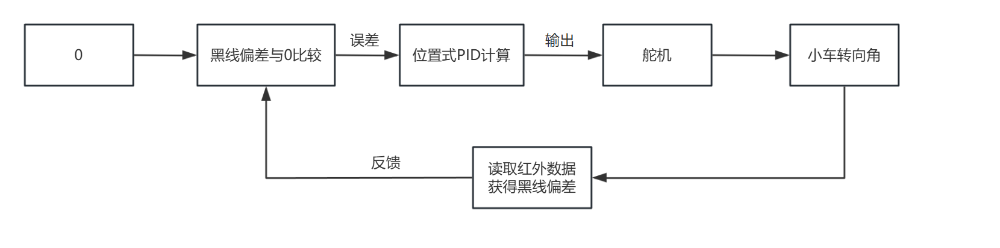

速度环选用了增量式PID控制，增量式PID可以很好地抑制积分分离，输出更加平稳，而且能很好地将小车速度稳定在目标速度，对于题目要求的爬坡性能很有帮助。速度环使用编码器反馈的车轮速度作为输入，基础速度加上角度环的输出作为目标速度，经过增量式PID计算后输出相应的占空比到电机驱动，电机驱动再控制电机带动轮子达到相应的速度。

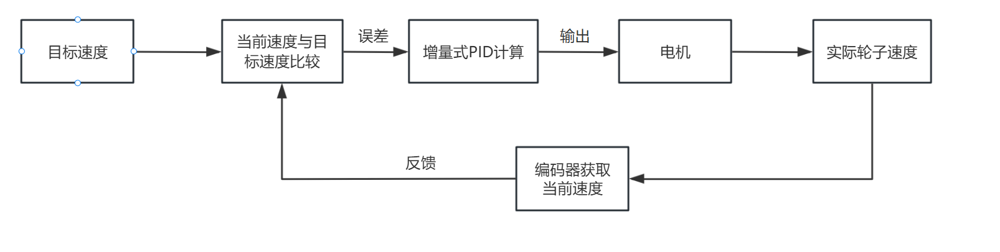

将两个环进行串联，得到整体的控制流程：

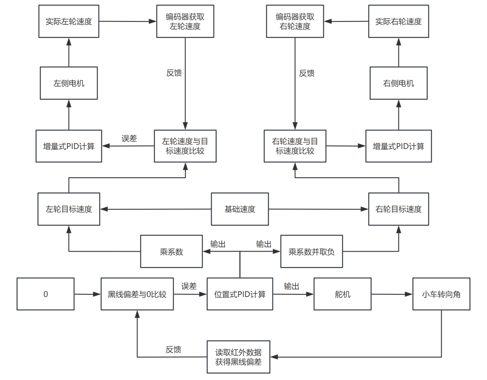

角度环PID计算的代码见附录

[角度环PID计算代码](#角度环PID计算代码)

速度环PID计算的代码见附录

[速度环PID计算代码](#速度环PID计算代码)

### 外部中断模块

编码器有两路输出，可以捕获其中一路输出的下降作为外部中断的触发源，在外部中断的中断服务函数里读取另一路输出的电平，根据电平的变化来判断编码器的转动方向，从而给相应的编码器计数加一或减一。

### 主循环模块

主循环模块用于读取M1卡、语音播报、LED灯控制等功能。主循环模块的主要功能如下:

- 1.读取M1卡：通过软件模拟SPI接口来读取M1卡的串号，根据不同的串号来识别不同的站点;
- 2.语音播报：通过两个IO口控制DY-SV17F语音模块的播放三个不同站点的音频;
- 3.LED灯控制：通过三个IO口控制LED灯的亮灭，代表相应的三个站点;

### RC522模块

RC522模块是一款非接触式读写卡模块，可以读取M1卡、S50卡、S70卡等卡片。RC522模块的引脚功能如下:

- 1.SDA: SPI NSS片选信号;
- 2.SCK: SPI时钟信号;
- 3.MOSI: SPI主机输出从机输入;
- 4.MISO: SPI主机输入从机输出;
- 5.IRQ: 中断输出;
- 6.GND: 接地;
- 7.RST: 复位信号;
- 8.VCC: 电源正极;

#### 原理简介

RC522模块有两个部分，射频读写器和IC卡。射频读写器向IC卡发一组固定频率的电磁波，卡片内有一个LC串联谐振电路，其频率与读写器发射的频率相同，这样在电磁波激励下，LC谐振电路产生共振，从而使电容内有了电荷；在这个电荷的另一端，接有一个单向导通的电子泵，将电容内的电荷送到另一个电容内存储，当所积累的电荷达到2V时，此电容可作为电源为其它电路提供工作电压，将卡内数据发射出去或接受读写器的数据。

非接触性IC卡与读卡器之间通过无线电波来完成读写操作。二者之间的通讯频率为13.56MHZ。非接触性IC卡本身是无源卡，当读写器对卡进行读写操作时，读写器发出的信号由两部分叠加组成:一部分是电源信号，该信号由卡接收后，与本身的L/C产生一个瞬间能量来供给芯片工作。另一部分则是指令和数据信号，指挥芯片完成数据的读取、修改、储存等，并返回信号给读写器,完成一次读写操作。

#### M1卡存储结构

M1卡分为16个扇区，每个扇区由4块（块0、块1、块2、块3）组成，（也将16个扇区的64个块按绝对地址编号为0~63，存储结构如下图所示：

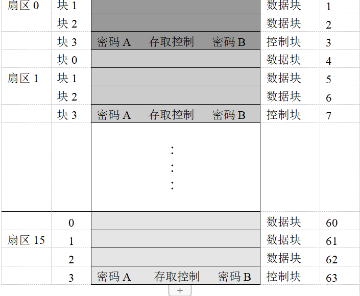

第0扇区的块0（即绝对地址0块），它用于存放厂商代码，已经固化，不可更改。

每个扇区的块0、块1、块2为数据块，可用于存贮数据。

数据块可作两种应用：

用作一般的数据保存，可以进行读、写操作。

用作数据值，可以进行初始化值、加值、减值、读值操作。

#### 工作流程

RC522模块的工作流程如下:

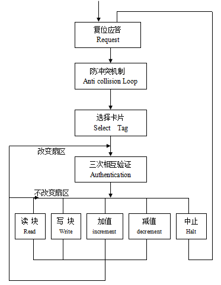

复位应答：M1射频卡的通讯协议和通讯波特率是定义好的，当有卡片进入读写器的操作范围时，读写器以特定的协议与它通讯，从而确定该卡是否为M1射频卡，即验证卡片的卡型。

防冲突机制：当有多张卡进入读写器操作范围时，防冲突机制会从其中选择一张进行操作，未选中的则处于空闲模式等待下一次选卡，该过程会返回被选卡的序列号。

选择卡片：选择被选中的卡的序列号，并同时返回卡的容量代码。

选择被选中的卡的序列号，并同时返回卡的容量代码。

三次互相确认：选定要处理的卡片之后，读写器就确定要访问的扇区号，并对该扇区密码进行密码校验，在三次相互认证之后就可以通过加密流进行通讯。（在选择另一扇区时，则必须进行另一扇区密码校验。）

#### SPI通信

由于STC89C52RC单片机没有硬件SPI接口，所以需要使用软件模拟SPI接口来驱动RC522模块。软件SPI通过控制MISO引脚和MOSI端口引脚的高低电平来控制数据的进出，通过控制SCK引脚的高低电平来控制数据的时钟。

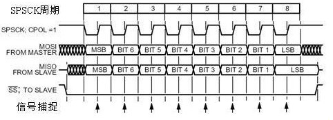

RC552采用模式3，上图为模式3的时序图，根据时序图写发送数据，共有8个时钟周期，所以循环8次， 按位查询需要发送的数据的高低电平，0将MOSI引输出低电平，1将MOSI输出高电平，然后调SCK时钟引脚，使时钟引脚输出低电平（默认状态高电平），延时一会，输出高电平。

简单的代码实现参考附录。

[软件SPI写入RC522模块](#软件SPI写入RC522模块)

[软件SPI读取RC522模块](#软件SPI读取RC522模块)

### 智能公交设计的实现

上述的软件模块准备已经完成，接下来将这些模块整合到一起，实现智能公交设计的功能。

- 1.初始化相应的硬件模块，包括舵机、电机、编码器、红外传感器、RC522模块、语音模块、LED灯;
- 2.在定时器0中断里产生PWM波，控制舵机的转向角度和电机的速度;
- 3.在外部中断0和1中断里读取编码器数值;
- 4.在定时器1中断里实现黑色引导线位置检测、转换编码器数值为速度、PID控制算法、控制小车运行状态功能;
- 5.在主循环里实现读取M1卡、语音播报、LED灯控制等功能;

### 多功能循迹机器人的实现

- 1.初始化相应的硬件模块，包括舵机、电机、编码器、红外传感器、语音模块、LED灯;
- 2.在定时器0中断里产生PWM波，控制舵机的转向角度和电机的速度;
- 3.在外部中断0和1中断里读取编码器数值;
- 4.在定时器1中断里实现黑色引导线位置检测、任务状态切换、转换编码器数值为速度、PID控制算法、控制小车运行状态功能;
- 5.仔细调整电机PID参数，确保上坡时有足够动力，下坡时不会快速溜车;
- 6.使用任务状态切换功能，上坡检测到终点时，停车5秒钟，然后下坡;

## 总结

通过整合两个题目的要求，我设计了一个小车，硬件上具备两个题目的要求，软件上可以通过切换不同的模式来让小车实现两个题目的要求。

硬件部分，搭建了以四轮车模为基础的小车结构，集成了红外循迹模块、RC522读卡模块、编码器、电机驱动模块以及舵机驱动系统，并且通过修改电机上的编码器，恢复了方向检测功能。

软件部分，通过模拟SPI通信驱动RC522模块，完成M1卡的读写，调用语音模块实现了站点播报功能，并在主控程序中加入了位置式PID和增量式PID算法，用于更好地控制小车的方向和速度，保证其循迹和站点识别功能的稳定实现。

整个系统经过多次调试，完成了黑线循迹、站点识别、语音提示、PID控制以及路径规划等主要功能。通过这次设计，我学习到了很多关于嵌入式系统设计的知识，包括了硬件设计、软件设计、51单片机原理、智能卡的应用、PID控制算法、状态机编程等方面的知识，对我今后的学习和工作都有很大的帮助。

## 附录

### 实物图

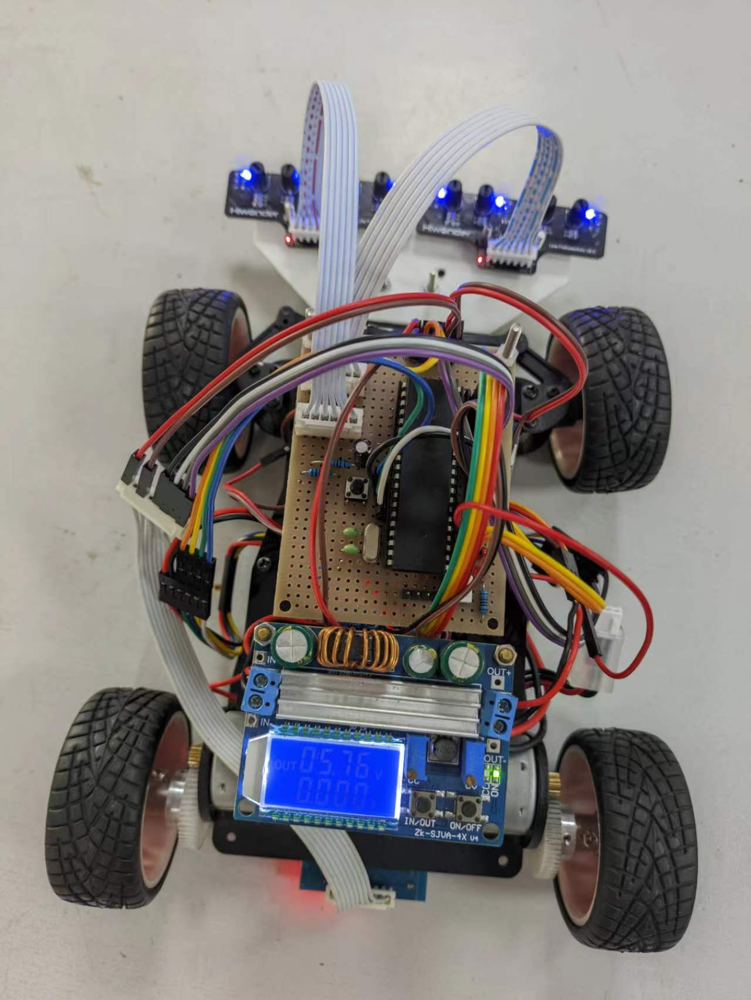

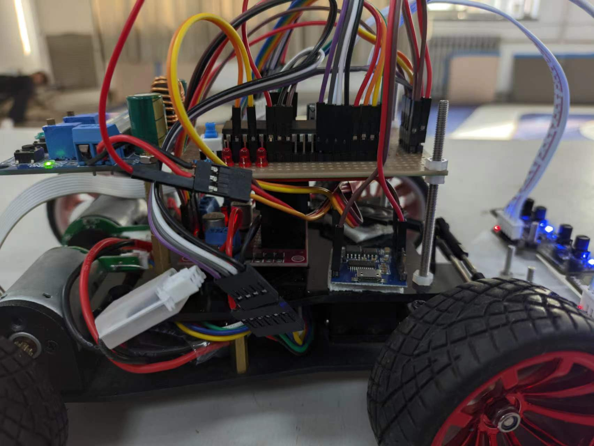

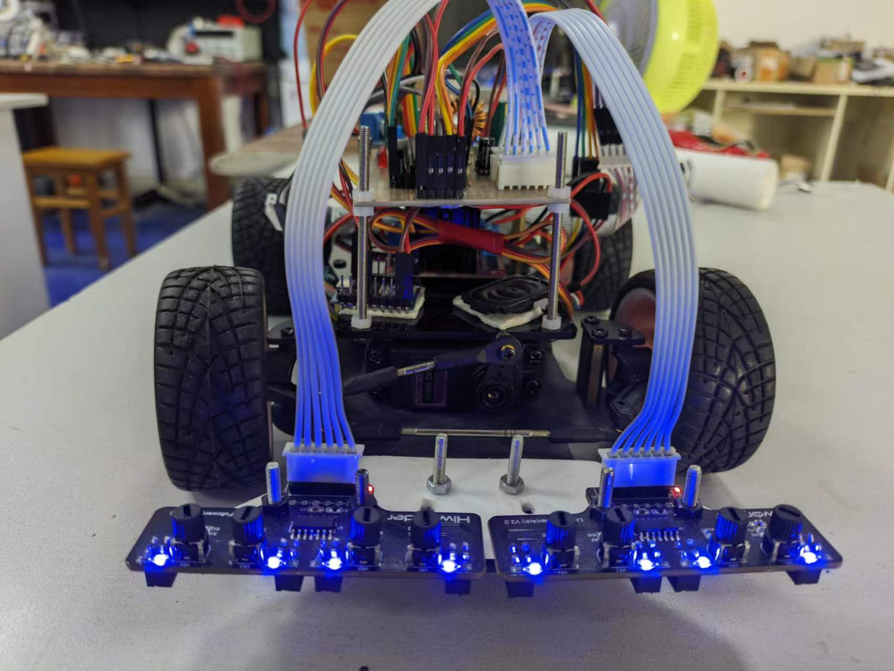

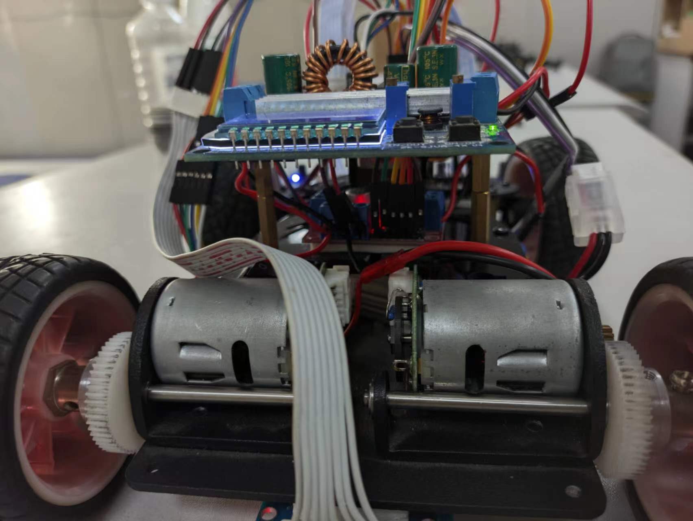

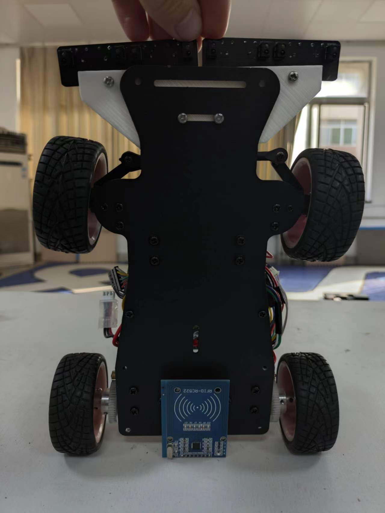

### 定时器0初始化代码

```c
static inline void timer0_init()
{
    TMOD |= 0x01;  // 设置定时器0为模式1（16位定时器模式，不自动重载）
    TH0 = 65458 >> 8;  // 将高8位装入TH0寄存器，初始值为65458的高位
    TL0 = 65458;       // 将低8位装入TL0寄存器，初始值为65458的低位
    TF0 = 0;  // 清除定时器0的溢出标志
    ET0 = 1;  // 使能定时器0中断
    TR0 = 1;  // 启动定时器0
}
```

### 定时器1初始化代码

```c
static inline void timer1_init()
{
    TMOD |= 0x10;  // 设置定时器1为模式1（16位定时器模式，不自动重载）
    TH1 = 55536 >> 8;  // 将高8位装入TH1寄存器，初始值为55536的高位
    TL1 = 55536;       // 将低8位装入TL1寄存器，初始值为55536的低位
    TF1 = 0;  // 清除定时器1的溢出标志
    ET1 = 1;  // 使能定时器1中断
    TR1 = 1;  // 启动定时器1
}
```

### 角度环PID计算代码
  
```c
    servo_error = servo_setpoint - position; // 计算当前偏差：目标位置与实际位置的差
    servo_integral += servo_error; // 计算累积误差，用于积分项
    servo_derivative = servo_error - servo_last_error; // 计算误差的变化率（与上一次误差相比），用于微分项
    servo_output = servo_Kp * servo_error + servo_Ki * servo_integral + servo_Kd * servo_derivative; // 计算PID控制输出
    servo_last_error = servo_error; // 保存当前误差以供下次计算微分项时使用

```

### 速度环PID计算代码

```c
    motor_last_last_error = motor_last_error; // 保存上上次误差
    motor_last_error = motor_error; // 保存上次误差
    motor_error = motor_setpoint - encoder_left_speed; // 计算当前偏差：目标速度与实际速度的差
    motor_derivative = (motor_error - 2 * motor_last_error + motor_last_last_error); // 计算误差的二阶差分，用于微分项
    motor_increment = motor_Kp * (motor_error - motor_last_error) + motor_Ki * motor_error + motor_Kd * motor_derivative; // 计算增量式PID的增量输出
    motor_output += motor_increment; // 增量输出加到当前输出上
```

### 软件SPI写入RC522模块

以下是向RC522模块写一个字节的数据的代码，函数输入要写入的寄存器地址和要写入的值:

```c
void WriteRawRC(unsigned char Address, unsigned char value)
{
  unsigned char i, ucAddr;

  MF522_SCK = 0; // 将时钟信号置低
  MF522_NSS = 0; // 将NSS信号置低，选择RC522模块
  ucAddr = ((Address << 1) & 0x7E); // 地址左移1位，保留7位有效地址位，准备传输
  
  // 发送地址字节（写操作，7位地址，1位写标志位）
  for(i = 8; i > 0; i--) // 循环发送8位地址数据
  {
    MF522_SI = ((ucAddr & 0x80) == 0x80); // 将最高位的值（1或0）赋给数据输入线SI
    MF522_SCK = 1; // 时钟信号置高，触发SPI传输该位
    ucAddr <<= 1; // 地址字节左移1位，准备传输下一位
    MF522_SCK = 0; // 时钟信号置低，完成该位的传输
  }

  // 发送数据字节（要写入寄存器的值）
  for(i = 8; i > 0; i--) // 循环发送8位数据
  {
    MF522_SI = ((value & 0x80) == 0x80); // 将最高位的值赋给数据输入线SI
    MF522_SCK = 1; // 时钟信号置高，触发SPI传输该位
    value <<= 1; // 数据字节左移1位，准备传输下一位
    MF522_SCK = 0; // 时钟信号置低，完成该位的传输
  }
  MF522_NSS = 1; // 释放NSS信号，完成传输
  MF522_SCK = 1; // 时钟信号置高，复位状态
}
```

### 软件SPI读取RC522模块

以下是从RC522模块读取一个字节的数据的代码，函数输入要读取的寄存器地址，返回读出的值:

```c
unsigned char ReadRawRC(unsigned char Address)
{
  unsigned char i, ucAddr;
  unsigned char ucResult = 0;
  
  MF522_SCK = 0; // 将时钟信号置低
  MF522_NSS = 0; // 将NSS信号置低，选择RC522模块
  ucAddr = ((Address << 1) & 0x7E) | 0x80; // 地址左移1位，保留7位有效地址位，并设置读操作标志位（最高位为1）
  
  // 发送地址字节（读操作，7位地址，1位读标志位）
  for(i = 8; i > 0; i--) // 循环发送8位地址数据
  {
    MF522_SI = ((ucAddr & 0x80) == 0x80); // 将最高位的值赋给数据输入线SI
    MF522_SCK = 1; // 时钟信号置高，触发SPI传输该位
    ucAddr <<= 1; // 地址字节左移1位，准备传输下一位
    MF522_SCK = 0; // 时钟信号置低，完成该位的传输
  }
  
  // 接收数据字节（从寄存器读取的值）
  for(i = 8; i > 0; i--) // 循环接收8位数据
  {
    MF522_SCK = 1; // 时钟信号置高，准备接收数据
    ucResult <<= 1; // 将当前结果左移，为接收的位腾出空间
    ucResult |= (bit)MF522_SO; // 将SO引脚的值（1或0）赋给数据字节的最低位
    MF522_SCK = 0; // 时钟信号置低，完成该位的接收
  }
  
  MF522_NSS = 1; // 释放NSS信号，完成传输
  MF522_SCK = 1; // 时钟信号置高，复位状态
  return ucResult; // 返回读取到的寄存器值
}
```
